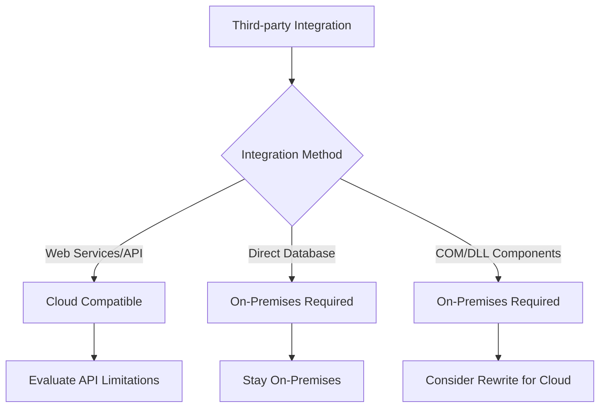
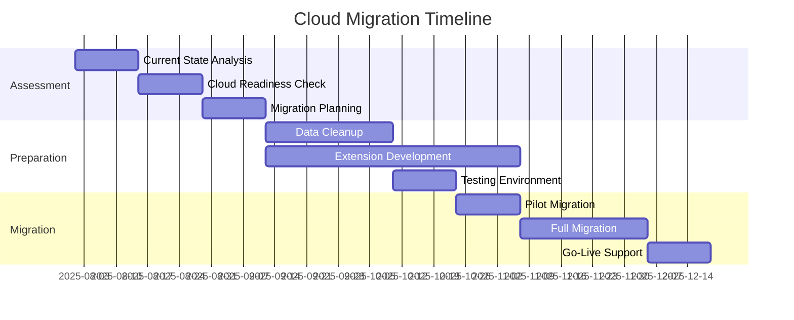

# Business Central Cloud vs On-Premises: The Complete Migration Decision Framework

The decision between Business Central Cloud (SaaS) and On-Premises deployment is one of the most critical choices your organization will make. Having guided over 50 companies through this decision over the past 5 years, I've developed a comprehensive framework that removes the guesswork.

## The Current Landscape: Why This Decision Matters More Than Ever

Microsoft's strategic shift toward cloud-first development means **new features are released to Cloud first**, often with 6-12 month delays for On-Premises. However, for many organizations, On-Premises remains the better choice due to specific business requirements.

### The Numbers That Matter
- **Cloud adoption rate**: 67% of new BC implementations choose Cloud
- **Migration timeline**: Average 8-14 months for complex On-Premises to Cloud migrations
- **Cost difference**: Cloud can be 20-40% more expensive initially, but 35% cheaper over 5 years
- **Feature gap**: On-Premises typically lags 2-3 releases behind Cloud features

## Decision Framework: The SCALE Method

I've developed the **SCALE framework** to help organizations make this critical decision:

- **S**ecurity & Compliance Requirements
- **C**ustomization & Integration Needs  
- **A**dministrative Capabilities
- **L**ong-term Costs & Scalability
- **E**xisting Infrastructure & Expertise

## 1. Security & Compliance Requirements

### Cloud Advantages
- **SOC 2 Type II**, **ISO 27001**, **FedRAMP** certifications
- **99.9% uptime SLA** with automatic failover
- **Automatic security updates** and patches
- **Advanced threat protection** and monitoring

### On-Premises Advantages
- **Complete data control** and physical location
- **Custom security policies** and air-gapped networks
- **Industry-specific compliance** (ITAR, certain financial regulations)
- **No data residency concerns**

### Decision Matrix: Security & Compliance

| Requirement | Cloud Score | On-Prem Score | Weight |
|-------------|-------------|---------------|---------|
| Standard compliance (SOX, GDPR) | 9/10 | 7/10 | High |
| Data sovereignty | 6/10 | 10/10 | Medium |
| Custom security policies | 5/10 | 10/10 | High |
| Automatic security updates | 10/10 | 3/10 | Medium |
| 24/7 monitoring | 10/10 | 5/10 | High |

## 2. Customization & Integration Needs

### Cloud Capabilities
```json
{
  "extensions": "AL extensions only",
  "customization": "Limited to supported APIs",
  "integrations": "Power Platform, Azure services",
  "database_access": "Read-only via API/OData",
  "third_party_tools": "Web services and APIs only"
}
```

### On-Premises Capabilities
```json
{
  "extensions": "AL + C/AL legacy support",
  "customization": "Full database and application access",
  "integrations": "Any technology stack",
  "database_access": "Full SQL Server access",
  "third_party_tools": "Direct database integration possible"
}
```

### Critical Questions for Your Organization

**1. Do you have C/AL customizations?**
- **Yes**: On-Premises required (for now) or plan migration to AL
- **No**: Cloud migration possible

**2. Do you need direct database access?**
- **Yes**: On-Premises required
- **No**: Cloud viable with API integration

**3. Third-party integrations complexity?**


## 3. Administrative Capabilities

### Cloud: Reduced IT Overhead
**Microsoft Manages:**
- Server hardware and OS updates
- SQL Server maintenance and backups
- Business Central application updates
- Security patching and monitoring
- Disaster recovery and high availability

**You Manage:**
- User management and permissions
- Data configuration and setup
- Extension deployment and management
- Integration monitoring

### On-Premises: Full Control, Full Responsibility
**You Manage Everything:**
- Server hardware and virtualization
- Windows Server and SQL Server licensing
- Business Central installation and updates
- Backup and disaster recovery
- Security monitoring and patching
- Performance tuning and optimization

### IT Capability Assessment Tool

Rate your organization (1-5 scale):

```al
// Calculate your IT Readiness Score
procedure CalculateITReadiness(): Integer
var
    Scores: array[8] of Integer;
begin
    // Rate each area 1-5
    Scores[1] := WindowsServerExpertise;      // Windows Server admin skills
    Scores[2] := SQLServerExpertise;         // SQL Server DBA skills  
    Scores[3] := NetworkSecuritySkills;      // Network and security expertise
    Scores[4] := BackupRecoveryCapability;   // Backup/DR processes
    Scores[5] := HardwareManagement;         // Server hardware management
    Scores[6] := MonitoringCapabilities;     // System monitoring tools
    Scores[7] := UpdateManagementProcess;    // Change management processes
    Scores[8] := BusinessContinuityPlanning; // BCP and disaster recovery
    
    exit(GetArrayAverage(Scores));
end;
```

**Scoring:**
- **4.0-5.0**: Strong candidate for On-Premises
- **3.0-3.9**: Consider managed On-Premises or hybrid
- **1.0-2.9**: Cloud strongly recommended

## 4. Long-term Costs & Scalability

### Total Cost of Ownership (TCO) Analysis

**5-Year TCO Comparison** (100 users):

#### Cloud Costs
```
Annual Costs:
├── Licenses: $168,000/year (100 users × $140/month)
├── Additional storage: $2,400/year
├── Premium support: $12,000/year
├── Integration platform: $8,000/year
└── Training/consulting: $15,000/year
Total Annual: $205,400
5-Year Total: $1,027,000
```

#### On-Premises Costs
```
Initial Investment:
├── Hardware: $75,000
├── Software licenses: $145,000
├── Implementation: $85,000
└── Setup/migration: $45,000
Year 1 Total: $350,000

Annual Ongoing:
├── Maintenance: $35,000
├── IT staff allocation: $65,000
├── Utilities/hosting: $8,000
├── Upgrades: $25,000
└── Support: $15,000
Annual Ongoing: $148,000
5-Year Total: $942,000
```

### Cost Calculator Tool

```javascript
function calculateTCO(users, years, complexity) {
    const cloudCostPerUser = 140; // Monthly
    const onPremInitialCostPerUser = 2500;
    const onPremAnnualCostPerUser = 1200;
    
    const complexityMultiplier = {
        'simple': 1.0,
        'moderate': 1.3,
        'complex': 1.8
    };
    
    const multiplier = complexityMultiplier[complexity];
    
    const cloudTotal = users * cloudCostPerUser * 12 * years * multiplier;
    const onPremTotal = (users * onPremInitialCostPerUser * multiplier) + 
                       (users * onPremAnnualCostPerUser * (years - 1) * multiplier);
    
    return {
        cloud: cloudTotal,
        onPremises: onPremTotal,
        difference: cloudTotal - onPremTotal,
        recommendation: cloudTotal < onPremTotal ? 'Cloud' : 'On-Premises'
    };
}
```

## 5. Existing Infrastructure & Expertise

### Infrastructure Assessment Checklist

**Current Environment:**
- [ ] Windows Server version and support lifecycle
- [ ] SQL Server edition and licensing model
- [ ] Virtualization platform (VMware, Hyper-V)
- [ ] Network bandwidth and reliability
- [ ] Backup and disaster recovery capabilities
- [ ] Security infrastructure and policies

**Team Expertise:**
- [ ] Business Central technical expertise level
- [ ] SQL Server administration capabilities
- [ ] Windows Server management skills
- [ ] Integration development experience
- [ ] Project management and change management

## Migration Strategies & Timelines

### Cloud Migration Approach

**Phase 1: Assessment (4-6 weeks)**


**Critical Migration Steps:**
1. **Data Assessment**: Identify and clean up legacy data
2. **Customization Analysis**: Convert C/AL to AL extensions
3. **Integration Mapping**: Redesign integrations for cloud APIs
4. **User Training**: Prepare team for cloud-specific features
5. **Cutover Planning**: Minimize downtime during migration

### On-Premises Optimization

**Upgrade Path Strategy:**
```al
// Version upgrade assessment
procedure AssessUpgradePath()
var
    CurrentVersion: Text;
    TargetVersion: Text;
    UpgradeComplexity: Option Simple,Moderate,Complex;
begin
    CurrentVersion := GetCurrentBCVersion();
    TargetVersion := GetLatestBCVersion();
    
    case CurrentVersion of
        'BC14', 'BC15':
            UpgradeComplexity := UpgradeComplexity::Complex;
        'BC16', 'BC17', 'BC18':
            UpgradeComplexity := UpgradeComplexity::Moderate;
        'BC19', 'BC20', 'BC21':
            UpgradeComplexity := UpgradeComplexity::Simple;
    end;
    
    PlanUpgradeStrategy(UpgradeComplexity);
end;
```

## Industry-Specific Considerations

### Manufacturing
- **On-Premises Advantages**: Shop floor integrations, real-time data requirements
- **Cloud Challenges**: Latency-sensitive operations, legacy equipment integration

### Financial Services  
- **Compliance Requirements**: May mandate on-premises for certain data types
- **Audit Trails**: Need for detailed system access logs and controls

### Healthcare
- **HIPAA Compliance**: Both models can be compliant with proper configuration
- **Integration Needs**: Often favor on-premises for legacy system integration

### Retail
- **Scalability**: Cloud excels for seasonal scaling and multi-location deployments
- **POS Integration**: Modern cloud-based POS systems integrate well with BC Cloud

## Decision Framework Scoring

### Scoring Your Organization

```al
procedure CalculateBestFitScore() DecisionScore: Record "Decision Score"
var
    SecurityScore: Integer;
    CustomizationScore: Integer;
    AdminScore: Integer;
    CostScore: Integer;
    InfrastructureScore: Integer;
begin
    // Calculate weighted scores (1-10 for each category)
    SecurityScore := EvaluateSecurityRequirements();
    CustomizationScore := EvaluateCustomizationNeeds();
    AdminScore := EvaluateAdminCapabilities();
    CostScore := EvaluateCostConsiderations();
    InfrastructureScore := EvaluateInfrastructure();
    
    // Weighted calculation (adjust weights based on your priorities)
    DecisionScore.CloudScore := 
        (SecurityScore * 0.25) + 
        (CustomizationScore * 0.30) + 
        (AdminScore * 0.20) + 
        (CostScore * 0.15) + 
        (InfrastructureScore * 0.10);
        
    DecisionScore.OnPremScore := 10 - DecisionScore.CloudScore;
    
    if DecisionScore.CloudScore > 6 then
        DecisionScore.Recommendation := 'Cloud'
    else if DecisionScore.OnPremScore > 6 then
        DecisionScore.Recommendation := 'On-Premises'
    else
        DecisionScore.Recommendation := 'Hybrid Approach';
end;
```

## Common Decision Mistakes to Avoid

### 1. **Cost-Only Decisions**
Many organizations focus solely on licensing costs, ignoring:
- Hidden implementation costs
- Training and change management
- Integration redevelopment
- Ongoing operational differences

### 2. **Underestimating Migration Complexity**
Common oversights:
- Data cleanup requirements (often 40% of project time)
- Integration redesign needs
- User training and adoption time
- Testing and validation phases

### 3. **Ignoring Future Requirements**
Consider your 3-5 year roadmap:
- Planned business expansion
- New integration requirements
- Changing compliance needs
- Technology strategy evolution

## Hybrid Approaches

### Cloud + On-Premises Integration
Some organizations benefit from hybrid deployments:
- **Primary BC in Cloud** with on-premises legacy system integration
- **Regional deployment** (Cloud in some regions, On-Premises in others)
- **Phased migration** (gradual move from On-Premises to Cloud)

## Making the Final Decision

### Executive Summary Template

```markdown
# Business Central Deployment Recommendation

## Executive Summary
Based on our SCALE assessment, we recommend: **[Cloud/On-Premises]**

## Key Decision Factors
1. **Security/Compliance**: [Score/Rationale]
2. **Customization Needs**: [Score/Rationale]  
3. **Administrative Capability**: [Score/Rationale]
4. **Cost Analysis**: [5-year TCO comparison]
5. **Infrastructure**: [Current state assessment]

## Implementation Timeline
- **Planning Phase**: [Duration]
- **Migration/Upgrade**: [Duration]
- **Go-Live**: [Target date]

## Investment Required
- **Year 1**: $[Amount]
- **Annual Ongoing**: $[Amount]
- **5-Year Total**: $[Amount]

## Risk Mitigation
[Key risks and mitigation strategies]

## Success Metrics
[How you'll measure success]
```

## Conclusion

The Business Central Cloud vs On-Premises decision isn't just about technology—it's about aligning your ERP strategy with your business goals, capabilities, and constraints. Use the SCALE framework to systematically evaluate your options and make a data-driven decision.

Remember: **There's no universally "right" choice**. The best deployment model is the one that fits your organization's specific needs, capabilities, and strategic direction.

### Next Steps

1. **Complete the SCALE assessment** for your organization
2. **Calculate your 5-year TCO** for both models
3. **Engage stakeholders** across IT, finance, and business units
4. **Develop a detailed implementation plan** based on your chosen path
5. **Plan for success measurement** and ongoing optimization

---

**Need help with your Cloud vs On-Premises decision?** [Schedule a consultation](mailto:contact@ricardocarvalho.dev) for a customized assessment and recommendation based on your specific requirements.

**Related Resources:**
- [Business Central Migration Checklist: 50 Critical Steps](./bc-migration-checklist)
- [Cloud Integration Patterns for Business Central](./bc-cloud-integration-patterns)
- [On-Premises Optimization Guide for Modern Business Central](./bc-onprem-optimization)
